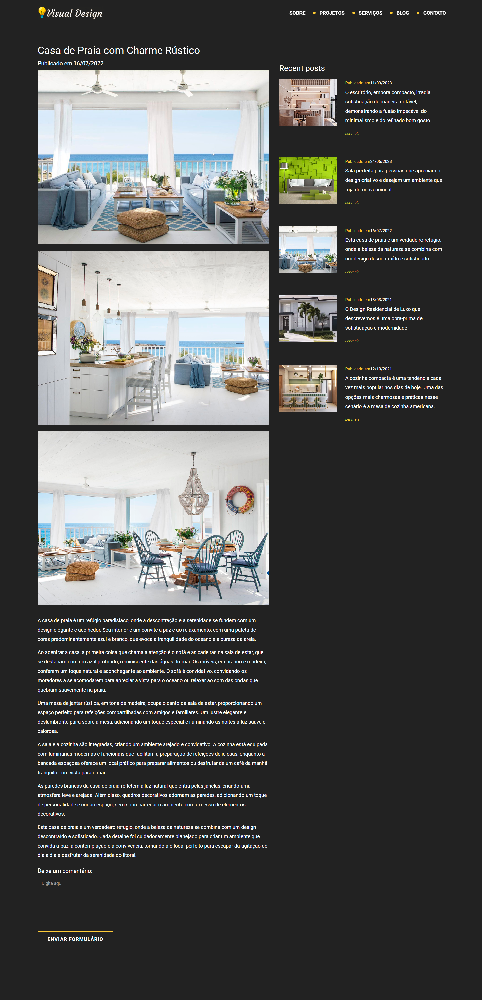

<h1 align="center">Visual Designer</h1>

## 💻 Projeto

✨ Neste projeto, eu recriei um site de arquitetura usando React, uma das bibliotecas mais populares e poderosas do JavaScript. O site original era feito com HTML, CSS e Bootstrap, mas eu quis migrar para o React para aproveitar os benefícios de ter componentes reutilizáveis. 

🔗 [Visite o site Visual Designer](https://visual-designer-rust.vercel.app/)

## 🚀 Tecnologias Utilizadas

- **TypeScript**: Adiciona tipagem estática ao código, aumentando a segurança e a previsibilidade.
- **React**: Permite a criação de uma interface de usuário interativa e eficiente.
- **Bootstrap**: Oferece um framework CSS para desenvolver sites responsivos e adaptáveis.
- **Vite**: Proporciona uma ferramenta de construção rápida e poderosa para projetos modernos.

## 🔖 Layout

    

